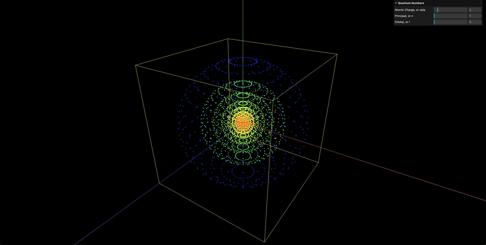

# Interactive Radial Equation

This is an interactive visualization of
[hydrogen_radial.c](https://www.fisica.uniud.it/~giannozz/Didattica/MQ/Software/C/hydrogen_radial.c) with color-mapping using JavaScript, WebAssembly, and Three.js.

It solves the radial portion of the Schrodinger Equation for Hydrogen atom.

## Demo

## Explanations

### Initialization
Initialize with `xmin`, `dx`, `rmax`, `zeta/zmesh`.

    xmin = -8.;
    dx = 0.01;
    rmax = 100.;
    // zmesh = zeta = Atomic Charge (user input #1)

`zeta` is the atomic charge.

Hydrogen atom only has 1 proton, the atomic charge is `e = 1.602e-19`.

`mesh` is the number of grid points.

    mesh = (int ) ((log(zmesh * rmax) - xmin) / dx);

`x` is the radial coordinate.

    // i = 0 to mesh
    x = xmin + dx * i;

### After `Atomic Charge`
`r` in `pot.out` and `wfc.out` is the radial distance. When `zmesh = 1, r_0 = 3.35e-4`.

    r[i] = exp(x) / zmesh;
    rmax = 100.;

`V(r)` in `pot.out` is spherically symmetric potential energy. When `zmesh = 1, r_0 = 3.35e-4`, we obtain `V(r) = -5.961e3`.

    vpot[i] = -2 * zeta / r[i];

Both `r` and `V(r)` in `pot.out` is determined after getting `Atomic Charge` before entering `n` and `l`.

### After getting quantum numbers `u` and `l`
`n` is the principal quantum number that describes the energy level of an electron, where n = 1, 2, 3, and so on. (user input #2)

`l` is the angular momentum quantum number that describes the orbital shape, where l = 0, ..., n-1. (user input #3)

`sqr[i]` and `r2[i]` is the square root and square of `r[i]`.
    
    sqr[i] = sqrt(r[i]);
    r2[i] = r[i] * r[i];

`R(r)` is radial wave function.
 
    = y[i] / sqr[i]

`X(r)` or `ψ(r)` is scaled (or reduced) radial wave function, where $ψ(r) = r R(r)$.

`V_eff` in `wfc.out` is effective potential energy function.

    = vpot[i] + l*(l+1)/r2[i]

## References

- webMathematica - Hydrogen [link](https://library.wolfram.com/webMathematica/Physics/Hydrogen.jsp)

- hydrogen_radial.c [link](https://www.fisica.uniud.it/~giannozz/Didattica/MQ/Software/C/hydrogen_radial.c)

- Lecture notes "Numerical Methods in Quantum Mechanics" by Paolo Giannozzi [link](https://www.fisica.uniud.it/~giannozz/Corsi/MQ/LectureNotes/mq.pdf)

- "Quantum Book" by Daniel V. Schroeder [link](https://physics.weber.edu/schroeder/quantum/QuantumBook.pdf)

- Radial and Angular Parts of Atomic Orbitals [link](https://chem.libretexts.org/Bookshelves/Physical_and_Theoretical_Chemistry_Textbook_Maps/Supplemental_Modules_(Physical_and_Theoretical_Chemistry)/Quantum_Mechanics/10%3A_Multi-electron_Atoms/Radial_and_Angular_Parts_of_Atomic_Orbitals)

- The Wavefunctions of a Rigid Rotator are Called Spherical Harmonics [link](https://chem.libretexts.org/Courses/Pacific_Union_College/Quantum_Chemistry/06%3A_The_Hydrogen_Atom/6.02%3A_The_Wavefunctions_of_a_Rigid_Rotator_are_Called_Spherical_Harmonics)

- Orbital Shapes - Energy Wave Theory [link](https://energywavetheory.com/atoms/orbital-shapes/)

- The Radial Wavefunction Solutions - Quantum Mechanics UCSD [link](https://quantummechanics.ucsd.edu/ph130a/130_notes/node233.html)